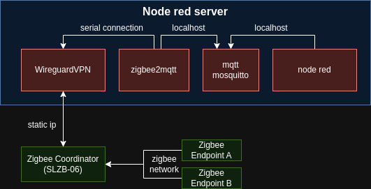

# Zigbee documenation
In this document, I want to explain what Zigbee is and how to work with it. The main goal is to explain how to configure a Zigbee coordinator and connect it to your remote server for further use with Node-RED.

## What is Zigbee

Zigbee is a protocol used to link smart devices like lights, plugs, and smart locks to a home network. Zigbee has three types of devices that together form a Zigbee network. These are coordinators, endpoints, and routers.

1. **Coordinator**: Used to set up and configure the Zigbee network.
2. **Endpoints**: Typical smart devices like lights and sensors that can connect to the Zigbee coordinator.
3. **Routers**: Used to extend the range of the Zigbee network.


## Connect to Zigbee Coordinator

We'll start with the coordinator. In this example, I'll use the SLZB-06M. The SLZB-06M coordinator has one Type-C port and one Ethernet port. Connect the Ethernet port to your local network through LAN, and connect the Type-C port to your PC. Then, navigate to your WiFi router page, and look for your coordinator's IP address. Copy the IP address and navigate to it through your browser.

If you see any kind of interface like the one in the picture below, that means everything went well!


## Configure Zigbee

### Update Drivers

It is possible that upon arrival your Zigbee coordinator was not flashed with the most recent drivers. To fix that, navigate to [this page](https://smlight.tech/flasher) and flash your Zigbee device with new drivers according to your Zigbee Coordinator family (in my case, it's the SLZB-06 family).


### Activate coordinator mode
Open your Zigbee Control Panel. Navigate to the *Mode* page and choose *Zigbee Coordinator*.


## Process Overview

From this point on, we'll perform operations on a remote server by installing tools like Zigbee2MQTT and WireGuard VPN. For a general overview, here's the diagram of our end goal.



## WireGuard VPN

To connect our Zigbee coordinator to the remote server's local network, we'll use WireGuard VPN.

### Install WireGuard
```
sudo apt install wireguard
```

### Generate keys for the host and for your zigbee
```
umask 077
wg genkey > hostPrivatekey
wg pubkey < hostPrivatekey > hostPublickey
wg genkey > zigbeePrivatekey
wg pubkey < zigbeePrivatekey > zigbeePublickey
```

### Create new wireguard interface
```
ip link add dev wg0 type wireguard
ip address add dev wg0 192.168.2.1 peer 192.168.2.2
```

### Configure the interface
```
wg set wg0 listen-port 51820 private-key /path/to/host-private-key peer zigbeePublicKeyAsTextABCD12345 allowed-ips 192.168.2.2 endpoint [actual ip of your zigbee coord]:51820
```

### Launch Wireguard wg0 interface
```
ip link set up dev wg0
```

## Configure WireGuard on your Zigbee
Now the same needs to be done on the Zigbee side. Open the Zigbee Control Panel, navigate to the VPN tab, and fill out the fields.


To check that everything works, ping `192.168.2.2` on the server side.


## Next: Zigbee2MQTT - What is it and How to Connect It?

Zigbee operates on its own protocol. To utilize it, we need to translate it to MQTT. This is where Zigbee2MQTT comes in.

### Example Docker Container

Install Docker on your server.
Download the example from this repository named `z2m_docker` container. I've already filled out most of the values, but some may differ based on your setup. Most of the information needed to set up Zigbee2MQTT can be found in the "Zigbee Control Panel/Z2M and ZHA". There, you'll find the required serial port, adapter mode, and baudrate that should match in your `docker-compose.yml` and `zigbee2mqtt-data/configuration.yaml`.


### Finally: Launch Z2M Docker and Prepare Your Zigbee Endpoint

To start using Zigbee2MQTT, launch the `z2m_docker` container and prepare your Zigbee endpoint. For this example, I'm using a Zigbee water leak detector, which can be connected by holding its button for 5 seconds.

Ideally, you could activate the Z2M frontend, but for this example, viewing data through Docker logs should be fine.

If everything was done correctly, you should see the output of your Zigbee endpoint through Docker logs.


## Last Part: View Zigbee Data in Node-RED

Here, I want to provide you with a very basic Node-RED setup that outputs messages from your MQTT. You can download it from this repository. It's named `zigbee_nodered.json`. The configuration for Node-Red is very minimal. Just make sure that your mqtt node point to your local mqtt server (in my case it's localhost:1883 with default mqtt port)


If everything went well, you should see data output in the console.


